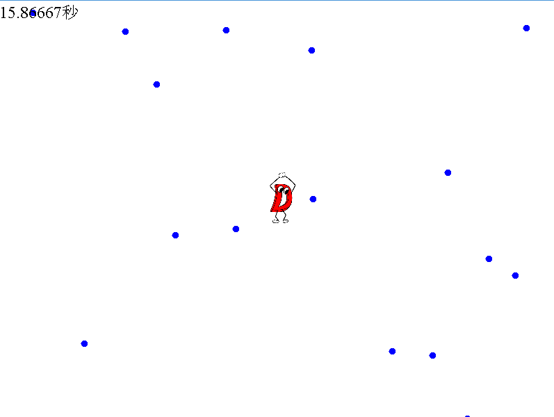

# とりあえず何か動くものを作ろう

## 今回作るゲーム

今回は

- プレイヤーはD言語くんを動かす
- ウィンドウの周りから弾が飛んでくる
- 避ける
- あたったらゲームオーバー

という弾幕避けゲーを作ることにします。

倒す敵とかも今回は作らないため、ひたすら避けて、避けた時間をスコアにする、そんな感じのゲームにします。

## プレイヤーが動くところを作ろう

前のコードの、moveの中身をいじることにする

```java
	// この下を頻繁に切り貼りします
	public int x = 400,y = 300;
	public void move(){
		int v = 6;
		int w = dman.getWidth(fr)/4;
		int h = dman.getHeight(fr)/4;
		if(isPressed(KeyEvent.VK_RIGHT)){
			x += v;
		}
		if(isPressed(KeyEvent.VK_LEFT)){
			x -= v;
		}
		if(isPressed(KeyEvent.VK_DOWN)){
			y += v;
		}
		if(isPressed(KeyEvent.VK_UP)){
			y -= v;
		}
		// 画面外に出さない
		if(x>800-w) x = 800-w;
		if(x<0) x = 0;
		if(y>600-h) y = 600-h;
		if(y<0) y = 0;
		Graphics2D g2 = (Graphics2D)buf.getGraphics();
		g2.drawImage(dman,x,y,w,h,fr);
	}
```

とりあえず、D言語くんが動きます！！

// 画面外に出さない というところの4つのif文は、画面の外に出そうになったら、画面内に収めるように処理です

ちょっと図を書くと分かります

## タイマーを作ろう

今回はひたすら避けるゲームのため、タイマーを作ろう

```java
	// この下を頻繁に切り貼りします
	public int x = 400,y = 300;
	public int time = 0;			// 🍣追加🍣
	public void move(){
		int v = 6;
		int w = dman.getWidth(fr)/4;
		int h = dman.getHeight(fr)/4;
		if(isPressed(KeyEvent.VK_RIGHT)){
			x += v;
		}
		if(isPressed(KeyEvent.VK_LEFT)){
			x -= v;
		}
		if(isPressed(KeyEvent.VK_DOWN)){
			y += v;
		}
		if(isPressed(KeyEvent.VK_UP)){
			y -= v;
		}
		// 画面外に出さない
		if(x>800-w) x = 800-w;
		if(x<0) x = 0;
		if(y>600-h) y = 600-h;
		if(y<0) y = 0;
		Graphics2D g2 = (Graphics2D)buf.getGraphics();
		g2.drawImage(dman,x,y,w,h,fr);

		// 🍣追加🍣
		time ++;
		float sec = (float)time/60f;
		g2.setFont(new Font(Font.SERIF, Font.PLAIN, 24));
		g2.setColor(Color.black);
		g2.drawString(String.format("%.4f秒",sec),0,25);
	}
```

time という変数を定義し、move一回につきtimeの値が1増えます

今回は60FPS、1秒に60回moveが呼ばれるため、timeが60増えるごとに1秒という計算になります

つまり、60で割ると、経過した秒数が得られます

また、String.formatというメソッドでは、変数を*いい感じに*整形してくれます

今回は、%.4fという部分で、float型の変数の値を小数点以下4桁で文字列に展開、ということをしています

## タイトル画面とリザルト画面とシーン遷移と

ゲームって、タイトル画面から始まって、ゲームをやって、リザルトを見て、タイトルに戻る、って流れがあるとゲームっぽさが出ると思うんですよ

ということで作りましょう

```java
	// この下を頻繁に切り貼りします
	public int x = 400,y = 300;
	public int time = 0;
	// state 0:Title 1:Game 2:Result
	public int state = 0;			// 🍣追加🍣 
	public void move(){
		Graphics2D g2 = (Graphics2D)buf.getGraphics();
		if(state==0){
			// この中を🍣追加🍣
			g2.setColor(Color.black);
			g2.setFont(new Font(Font.SERIF, Font.PLAIN, 48));
			g2.drawString("ゲーム入門制作",30,100);

			g2.setFont(new Font(Font.SERIF, Font.PLAIN, 24));
			g2.drawString("Zキーを押してスタート",400,400);

			if(onPressed(KeyEvent.VK_Z)){
				state = 1;
				// 初期化
				x = 400;
				y = 300;
				time = 0;
			}
		}else if(state == 1){
			// ここはさっきと🍣同じ🍣
			int v = 6;
			int w = dman.getWidth(fr)/4;
			int h = dman.getHeight(fr)/4;
			if(isPressed(KeyEvent.VK_RIGHT)){
				x += v;
			}
			if(isPressed(KeyEvent.VK_LEFT)){
				x -= v;
			}
			if(isPressed(KeyEvent.VK_DOWN)){
				y += v;
			}
			if(isPressed(KeyEvent.VK_UP)){
				y -= v;
			}
			// 画面外に出さない
			if(x>800-w) x = 800-w;
			if(x<0) x = 0;
			if(y>600-h) y = 600-h;
			if(y<0) y = 0;
			g2.drawImage(dman,x,y,w,h,fr);

			time ++;
			float sec = (float)time/60f;
			g2.setFont(new Font(Font.SERIF, Font.PLAIN, 24));
			g2.setColor(Color.black);
			g2.drawString(String.format("%.5f秒",sec),0,25);

			// 今のところ便宜的にXキーを押すとゲームオーバーとする
			if(onPressed(KeyEvent.VK_X)){
				state = 2;
			}
		}else if(state == 2){
			// この中は🍣追加🍣
			g2.setColor(Color.black);
			g2.setFont(new Font(Font.SERIF, Font.PLAIN, 32));
			g2.drawString("ゲームオーバー",30,100);

			float sec = (float)time/60f;
			g2.setColor(Color.red);
			g2.setFont(new Font(Font.SERIF, Font.PLAIN, 48));
			g2.drawString(String.format("スコア : %.5f 秒",sec),100,200);

			g2.setColor(Color.black);
			g2.setFont(new Font(Font.SERIF, Font.PLAIN, 24));
			g2.drawString("Zキーでコンティニュー",400,500);

			if(onPressed(KeyEvent.VK_Z)){
				state = 0;
			}
		}
	}
```

どうでしょう？

タイトル画面→ゲーム画面→リザルト画面 という流れが実現できたと思います

ポイントはstate変数です。これを使ってif文で分岐すると、まるっきり違う処理ができ、違う画面を描画することが出来ます

## 弾を作ってみよう

まずは1つだけ弾を作ってみましょう

プレイヤー同様に(x,y)を保持して、動かせば良さそうですね

ただ、プレイヤーと違って勝手に動かなきゃいけないので、ここでは速度ベクトルとして(vx,vy)も保持しましょう

```java
	// この下を頻繁に切り貼りします
	public int x = 400,y = 300;
	public float bx = 0, by = 100;			// 🍣追加🍣
	public float bvx = 3, bvy = 1;			// 🍣追加🍣
	public int br = 5;						// 🍣追加🍣
	public int time = 0;
	// state 0:Title 1:Game 2:Result
	public int state = 0; 
	public void move(){
		Graphics2D g2 = (Graphics2D)buf.getGraphics();
		if(state==0){
			g2.setColor(Color.black);
			g2.setFont(new Font(Font.SERIF, Font.PLAIN, 48));
			g2.drawString("ゲーム入門制作",30,100);

			g2.setFont(new Font(Font.SERIF, Font.PLAIN, 24));
			g2.drawString("Zキーを押してスタート",400,400);

			if(onPressed(KeyEvent.VK_Z)){
				state = 1;
				// 初期化
				x = 400;
				y = 300;
				// 🍣追加🍣
				bx = 0;
				by = 100;
				bvx = 3;
				bvy = 1;
				time = 0;
			}
		}else if(state == 1){
			int v = 6;
			int w = dman.getWidth(fr)/4;
			int h = dman.getHeight(fr)/4;
			if(isPressed(KeyEvent.VK_RIGHT)){
				x += v;
			}
			if(isPressed(KeyEvent.VK_LEFT)){
				x -= v;
			}
			if(isPressed(KeyEvent.VK_DOWN)){
				y += v;
			}
			if(isPressed(KeyEvent.VK_UP)){
				y -= v;
			}
			// 画面外に出さない
			if(x>800-w) x = 800-w;
			if(x<0) x = 0;
			if(y>600-h) y = 600-h;
			if(y<0) y = 0;
			g2.drawImage(dman,x,y,w,h,fr);

			// ここから🍣追加🍣
			bx += bvx;
			by += bvy;
			// 完全に画面外に出たらループさせる
			if(bx <= 0-br){
				bx = 800+br;
			}else if(bx >= 800+br){
				bx = 0-br;
			}
			if(by <= 0-br){
				by = 600+br;
			}else if(by >= 600+br){
				by = 0-br;
			}
			g2.setColor(Color.blue);
			g2.fillOval((int)(bx-br),(int)(by-br),2*br,2*br);
			// ここまで

			time ++;
			float sec = (float)time/60f;
			g2.setFont(new Font(Font.SERIF, Font.PLAIN, 24));
			g2.setColor(Color.black);
			g2.drawString(String.format("%.5f秒",sec),0,25);

			// 今のところ便宜的にXキーを押すとゲームオーバーとする
			if(onPressed(KeyEvent.VK_X)){
				state = 2;
			}
		}else if(state == 2){
			g2.setColor(Color.black);
			g2.setFont(new Font(Font.SERIF, Font.PLAIN, 32));
			g2.drawString("ゲームオーバー",30,100);

			float sec = (float)time/60f;
			g2.setColor(Color.red);
			g2.setFont(new Font(Font.SERIF, Font.PLAIN, 48));
			g2.drawString(String.format("スコア : %.5f 秒",sec),100,200);

			g2.setColor(Color.black);
			g2.setFont(new Font(Font.SERIF, Font.PLAIN, 24));
			g2.drawString("Zキーでコンティニュー",400,500);

			if(onPressed(KeyEvent.VK_Z)){
				state = 0;
			}
		}
	}
```

ついに敵対するオブジェクトの表示に成功しました！

あとは当たり判定を付けましょう、そしてゲームを終了させましょう

ここで、(ax,ay)と(bx,by)の距離は √((ax-bx)^2 + (ay-by)^2) であることは分かると思います

そのため、中心(ax,ay)半径arの円と、中心(bx,by)半径brの円とがあたっているかどうかは、

√((ax-bx)^2 + (ay-by)^2) <= (ar+br)

∴ (ax-bx)^2 + (ay-by)^2 <= (ar+br)^2

が真か偽かで分かります

```java
	// この下を頻繁に切り貼りします
	public int x = 400,y = 300;
	public float bx = 0, by = 100;
	public float bvx = 3, bvy = 1;
	public int br = 5;
	public int time = 0;
	// state 0:Title 1:Game 2:Result
	public int state = 0; 
	public void move(){
		Graphics2D g2 = (Graphics2D)buf.getGraphics();
		if(state==0){
			g2.setColor(Color.black);
			g2.setFont(new Font(Font.SERIF, Font.PLAIN, 48));
			g2.drawString("ゲーム入門制作",30,100);

			g2.setFont(new Font(Font.SERIF, Font.PLAIN, 24));
			g2.drawString("Zキーを押してスタート",400,400);

			if(onPressed(KeyEvent.VK_Z)){
				state = 1;
				// 初期化
				x = 400;
				y = 300;
				bx = 0;
				by = 100;
				bvx = 3;
				bvy = 1;
				time = 0;
			}
		}else if(state == 1){
			int v = 6;
			int w = dman.getWidth(fr)/4;
			int h = dman.getHeight(fr)/4;
			if(isPressed(KeyEvent.VK_RIGHT)){
				x += v;
			}
			if(isPressed(KeyEvent.VK_LEFT)){
				x -= v;
			}
			if(isPressed(KeyEvent.VK_DOWN)){
				y += v;
			}
			if(isPressed(KeyEvent.VK_UP)){
				y -= v;
			}
			// 画面外に出さない
			if(x>800-w) x = 800-w;
			if(x<0) x = 0;
			if(y>600-h) y = 600-h;
			if(y<0) y = 0;
			g2.drawImage(dman,x,y,w,h,fr);

			bx += bvx;
			by += bvy;
			// 完全に画面外に出たらループさせる
			if(bx <= 0-br){
				bx = 800+br;
			}else if(bx >= 800+br){
				bx = 0-br;
			}
			if(by <= 0-br){
				by = 600+br;
			}else if(by >= 600+br){
				by = 0-br;
			}
			g2.setColor(Color.blue);
			g2.fillOval((int)(bx-br),(int)(by-br),2*br,2*br);

			time ++;
			float sec = (float)time/60f;
			g2.setFont(new Font(Font.SERIF, Font.PLAIN, 24));
			g2.setColor(Color.black);
			g2.drawString(String.format("%.5f秒",sec),0,25);

			// ここから🍣追加🍣
			// 当たったらゲームオーバー
			// D言語くんの中心座標・当たり判定半径
			int cx = x + w/2;
			int cy = y + h/2;
			int cr = 10;
			// check
			float dx = (cx - bx);
			float dy = (cy - by);
			float dr = (cr + br);
			if(dx*dx + dy*dy <= dr*dr){
				// ゲームオーバーに移行
				state = 2;
			}
			// ここまで
		}else if(state == 2){
			g2.setColor(Color.black);
			g2.setFont(new Font(Font.SERIF, Font.PLAIN, 32));
			g2.drawString("ゲームオーバー",30,100);

			float sec = (float)time/60f;
			g2.setColor(Color.red);
			g2.setFont(new Font(Font.SERIF, Font.PLAIN, 48));
			g2.drawString(String.format("スコア : %.5f 秒",sec),100,200);

			g2.setColor(Color.black);
			g2.setFont(new Font(Font.SERIF, Font.PLAIN, 24));
			g2.drawString("Zキーでコンティニュー",400,500);

			if(onPressed(KeyEvent.VK_Z)){
				state = 0;
			}
		}
	}
```

当たります！！！！！！ これはもはやゲーム！！！！！！！！！

いやいやいやいやいや、こんなゲーム気さえ抜かなければ誰でもクリアできますね。。。。。。

## 弾を大量に生産する

じゃあ弾いっぱい出しちゃえばいいですね！

ということで、ちょっとだけJavaの新しい機能を紹介します

### ArrayList

ArrayListは、配列の強い版です。

何が強いかというと、通常の配列は最大の長さ(どれぐらいの数だけ保持できるか)を決めなければ使えませんでしたが、

ArrayListは動的にメモリを確保する動的配列と呼ばれるもののため、明示された上限がありません！

簡単な使い方は以下のとおりです

```java
import java.util.ArrayList;		// ArrayListをimport

// 宣言
ArrayList<Integer> arr = new ArrayList<>();		// 🙅 ArrayList<int> (クラスしか受け付けません)

// 値を追加する
arr.add(168);
arr.add(58);
arr.add(19);
arr.add(8);
arr.add(401);
arr.add(511);

// 値を順番に見る
for(int i=0;i<arr.size();i++){
	// 値を取得する
	int x = arr.get(i);
	System.out.println(x);
	// 値を変更する
	arr.set(i, x+15500000);
}
```

なるほど。実際使ってみたほうが分かるかもしれません

### 弾を大量に生産するコードを書く

ではこのArrayListを使って、1秒(=60フレーム)に1回弾を作るコードを書いてみましょう


```java
package gameprog;

import java.awt.*;
import javax.swing.*;

import java.io.File;
import javax.imageio.ImageIO;

import java.awt.image.BufferedImage;

import java.awt.event.*;

// 🍣追加🍣
import java.util.ArrayList;

public class Main {
	public static void main(String[] args){
		(new Main()).run();
	}
	public JFrame fr;
	public BufferedImage buf;
	public boolean[] keybef, keynow, keynext;
	public Image dman;
	public void run(){
		buf = new BufferedImage(800,600,BufferedImage.TYPE_INT_ARGB);

		keybef = new boolean[256];
		keynow = new boolean[256];
		keynext = new boolean[256];
		for(int i=0;i<256;++i)
			keybef[i] = keynow[i] = keynext[i] = false;

		// ウィンドウ生成
		fr = new JFrame("タイトル");
		// 閉じるボタンの挙動設定
		fr.setDefaultCloseOperation(JFrame.EXIT_ON_CLOSE);
		// ウィンドウサイズ変更不可に
		fr.setResizable(false);
		// ウィンドウの中身のサイズを調節 ここでは横800 x 縦600
		fr.getContentPane().setPreferredSize(new Dimension(800, 600));
		// 表示
		fr.setVisible(true);
		// サイズ調整
		fr.pack();
		// キーリスナー登録
		fr.addKeyListener(new keyclass());

		try{
			// このtryの中で画像を読み込む
			dman = ImageIO.read(new File("src/d3.png"));
		}catch(Exception e){
			e.printStackTrace();
		}

		// 無限ループ
		while(true){
			long beg = System.nanoTime();
			for(int i=0;i<256;++i){
				keybef[i] = keynow[i];
				keynow[i] = keynext[i];
			}
			Graphics2D g2 = (Graphics2D)buf.getGraphics();
			g2.setColor(Color.white);
			g2.fillRect(0,0,800,600);
			move();
			g2 = (Graphics2D)fr.getContentPane().getGraphics();
			g2.drawImage(buf,0,0,fr);
			// 60FPS用
			long range = System.nanoTime() - beg;
			long sleeptime = (16666666L - range)/1000000L;
			if(sleeptime < 0) sleeptime = 0;
			try{
				Thread.sleep(sleeptime);
			} catch (Exception e){
				e.printStackTrace();
			}
		}
	}

	public boolean isPressed(int key){
		return keynow[key];
	}
	public boolean onPressed(int key){
		return !keybef[key] && keynow[key];
	}
	public class keyclass implements KeyListener {
		@Override
		public void keyTyped(KeyEvent e) {}
		@Override
		public void keyPressed(KeyEvent e) {
			keynext[e.getKeyCode()] = true;
		}
		@Override
		public void keyReleased(KeyEvent e) {
			keynext[e.getKeyCode()] = false;
		}
	}

	// この下を頻繁に切り貼りします
	public int x = 400,y = 300;
	// 🍣追加🍣
	public ArrayList<Float> bxList, byList, bvxList, bvyList;		// ArrayList<float>ではない
	public int br = 5;
	public int time = 0;
	// state 0:Title 1:Game 2:Result
	public int state = 0; 
	public void move(){
		Graphics2D g2 = (Graphics2D)buf.getGraphics();
		if(state==0){
			g2.setColor(Color.black);
			g2.setFont(new Font(Font.SERIF, Font.PLAIN, 48));
			g2.drawString("ゲーム入門制作",30,100);

			g2.setFont(new Font(Font.SERIF, Font.PLAIN, 24));
			g2.drawString("Zキーを押してスタート",400,400);

			if(onPressed(KeyEvent.VK_Z)){
				state = 1;
				// 初期化
				x = 400;
				y = 300;
				time = 0;
				// 🍣追加🍣
				bxList = new ArrayList<>();
				byList = new ArrayList<>();
				bvxList = new ArrayList<>();
				bvyList = new ArrayList<>();
			}
		}else if(state == 1){
			int v = 6;
			int w = dman.getWidth(fr)/4;
			int h = dman.getHeight(fr)/4;
			if(isPressed(KeyEvent.VK_RIGHT)){
				x += v;
			}
			if(isPressed(KeyEvent.VK_LEFT)){
				x -= v;
			}
			if(isPressed(KeyEvent.VK_DOWN)){
				y += v;
			}
			if(isPressed(KeyEvent.VK_UP)){
				y -= v;
			}
			// 画面外に出さない
			if(x>800-w) x = 800-w;
			if(x<0) x = 0;
			if(y>600-h) y = 600-h;
			if(y<0) y = 0;
			g2.drawImage(dman,x,y,w,h,fr);

			// 🍣追加🍣
			// 新しく弾を生成
			if(time%60==0){
				bxList.add(0f);
				byList.add(100f);
				bvxList.add(3f);
				bvyList.add(1f);
			}

			// すべての弾を見るように🍣変更🍣
			for(int i=0;i<bxList.size();i++){
				float bx,by,bvx,bvy;
				bx = bxList.get(i);
				by = byList.get(i);
				bvx = bvxList.get(i);
				bvy = bvyList.get(i);
				bx += bvx;
				by += bvy;
				// 完全に画面外に出たらループさせる
				if(bx <= 0-br){
					bx = 800+br;
				}else if(bx >= 800+br){
					bx = 0-br;
				}
				if(by <= 0-br){
					by = 600+br;
				}else if(by >= 600+br){
					by = 0-br;
				}
				bxList.set(i,bx);
				byList.set(i,by);
				g2.setColor(Color.blue);
				g2.fillOval((int)(bx-br),(int)(by-br),2*br,2*br);
			}

			time ++;
			float sec = (float)time/60f;
			g2.setFont(new Font(Font.SERIF, Font.PLAIN, 24));
			g2.setColor(Color.black);
			g2.drawString(String.format("%.5f秒",sec),0,25);

			// 当たったらゲームオーバー
			// D言語くんの中心座標・当たり判定半径
			int cx = x + w/2;
			int cy = y + h/2;
			int cr = 10;
			// ここから🍣変更🍣
			for(int i=0;i<bxList.size();++i){
				float bx,by;
				bx = bxList.get(i);
				by = byList.get(i);
				float dx = (cx - bx);
				float dy = (cy - by);
				float dr = (cr + br);
				if(dx*dx + dy*dy <= dr*dr){
					// ゲームオーバーに移行
					state = 2;
					break;
				}
			}
		}else if(state == 2){
			g2.setColor(Color.black);
			g2.setFont(new Font(Font.SERIF, Font.PLAIN, 32));
			g2.drawString("ゲームオーバー",30,100);

			float sec = (float)time/60f;
			g2.setColor(Color.red);
			g2.setFont(new Font(Font.SERIF, Font.PLAIN, 48));
			g2.drawString(String.format("スコア : %.5f 秒",sec),100,200);

			g2.setColor(Color.black);
			g2.setFont(new Font(Font.SERIF, Font.PLAIN, 24));
			g2.drawString("Zキーでコンティニュー",400,500);

			if(onPressed(KeyEvent.VK_Z)){
				state = 0;
			}
		}
	}
}
```

はい！ 大量に弾が生成されましたね。

これで弾幕ゲーの完成です！！！

## 難易度調整

当然ですがこんなのではすぐ飽きられるのが目に見えています

ということで、乱数を使ってみましょう

### 乱数

```java
float rnd = (float)Math.random();
```

とすると、rndには0以上1未満の乱数が入ります

乱数はいわゆる「ランダム」を実現するもので、ゲームをいい感じに複雑にしてくれます

弾の生成で、角度と速度を乱数を使って生成するようにしましょう……

```java
			// 新しく弾を生成
			if(time%60==0){
				// [0,1) の範囲の乱数を2π倍して [0,2π) の範囲の乱数にする
				float angle = (float)Math.random() * (float)Math.PI * 2f;
				// [0,1) の範囲を4倍して3足すことで [3,7) の範囲の乱数にする
				float len = (float)Math.random() * 4f + 3f;
				float vx = (float)Math.cos(angle) * len;
				float vy = (float)Math.sin(angle) * len;
				bxList.add(400f);
				byList.add(0f);
				bvxList.add(vx);
				bvyList.add(vy);
			}
```

こっこれは！！？！？！？！？！？！



(わからないと思うけど青い弾が動いている)

ゲームですねぇ！！！！！！！！！！！！！

というわけで、一応名目上「弾幕ゲー」が完成しました！

## Extra 課題

さて、†弾幕ゲー†ができてしまったわけですが、まだ物足りないという人へ、このゲームの改善点をいくつか上げてみたいと思います

1. 弾の残像を描画したい！
1. Shiftキー押してる間はプレイヤーの動く速度が遅くなるようにしたい！
1. 弾の動き方を等速直線運動以外にしたい！
1. 特に意味は無いけどD言語くんの画像を回転させてみたい！
1. 弾が生成される速度を上げたり下げたりしたい！
1. 弾も画像を使って描画したい！
1. 当たり判定を表示したい！
1. などなど...

いっぱいありますね。これ以外にも思いつく改善点はいくつもあると思います。

基本的にこれまでやってきたことで対応できますが、対応できないことも出てくると思います(例えば画像の回転は今回やっていません)

そういった「やりたいけど分からない」のために、Googleが存在します

今回使った技術は、プログラミング言語Javaと、ウィンドウを表示するswingという機能を用いています

そのため、"Java swing 画像 回転"などと指定してGoogle検索をすると…… 一応出てきますね。

他にも"Graphics2D 画像 回転"などのキーワードを使うと良いかもしれません。

このようにして検索や知恵を駆使してゲームを自分だけのものに進化させていきましょう！

エラーが出ることを怖がらず、いろいろなコードを書いてみると良いです。


というわけで、ゲーム制作編1はこれにて完結です

## 完

## ソースコード全体

```java
package gameprog;

import java.awt.*;
import javax.swing.*;

import java.io.File;
import javax.imageio.ImageIO;

import java.awt.image.BufferedImage;

import java.awt.event.*;

import java.util.ArrayList;

public class Main {
	public static void main(String[] args){
		(new Main()).run();
	}
	public JFrame fr;
	public BufferedImage buf;
	public boolean[] keybef, keynow, keynext;
	public Image dman;
	public void run(){
		buf = new BufferedImage(800,600,BufferedImage.TYPE_INT_ARGB);

		keybef = new boolean[256];
		keynow = new boolean[256];
		keynext = new boolean[256];
		for(int i=0;i<256;++i)
			keybef[i] = keynow[i] = keynext[i] = false;

		// ウィンドウ生成
		fr = new JFrame("タイトル");
		// 閉じるボタンの挙動設定
		fr.setDefaultCloseOperation(JFrame.EXIT_ON_CLOSE);
		// ウィンドウサイズ変更不可に
		fr.setResizable(false);
		// ウィンドウの中身のサイズを調節 ここでは横800 x 縦600
		fr.getContentPane().setPreferredSize(new Dimension(800, 600));
		// 表示
		fr.setVisible(true);
		// サイズ調整
		fr.pack();
		// キーリスナー登録
		fr.addKeyListener(new keyclass());

		try{
			// このtryの中で画像を読み込む
			dman = ImageIO.read(new File("src/d3.png"));
		}catch(Exception e){
			e.printStackTrace();
		}

		// 無限ループ
		while(true){
			long beg = System.nanoTime();
			for(int i=0;i<256;++i){
				keybef[i] = keynow[i];
				keynow[i] = keynext[i];
			}
			Graphics2D g2 = (Graphics2D)buf.getGraphics();
			g2.setColor(Color.white);
			g2.fillRect(0,0,800,600);
			move();
			g2 = (Graphics2D)fr.getContentPane().getGraphics();
			g2.drawImage(buf,0,0,fr);
			// 60FPS用
			long range = System.nanoTime() - beg;
			long sleeptime = (16666666L - range)/1000000L;
			if(sleeptime < 0) sleeptime = 0;
			try{
				Thread.sleep(sleeptime);
			} catch (Exception e){
				e.printStackTrace();
			}
		}
	}

	public boolean isPressed(int key){
		return keynow[key];
	}
	public boolean onPressed(int key){
		return !keybef[key] && keynow[key];
	}
	public class keyclass implements KeyListener {
		@Override
		public void keyTyped(KeyEvent e) {}
		@Override
		public void keyPressed(KeyEvent e) {
			keynext[e.getKeyCode()] = true;
		}
		@Override
		public void keyReleased(KeyEvent e) {
			keynext[e.getKeyCode()] = false;
		}
	}

	// この下を頻繁に切り貼りします
	public int x = 400,y = 300;
	public ArrayList<Float> bxList, byList, bvxList, bvyList;		// ArrayList<float>ではない
	public int br = 5;
	public int time = 0;
	// state 0:Title 1:Game 2:Result
	public int state = 0; 
	public void move(){
		Graphics2D g2 = (Graphics2D)buf.getGraphics();
		if(state==0){
			g2.setColor(Color.black);
			g2.setFont(new Font(Font.SERIF, Font.PLAIN, 48));
			g2.drawString("ゲーム入門制作",30,100);

			g2.setFont(new Font(Font.SERIF, Font.PLAIN, 24));
			g2.drawString("Zキーを押してスタート",400,400);

			if(onPressed(KeyEvent.VK_Z)){
				state = 1;
				// 初期化
				x = 400;
				y = 300;
				time = 0;
				bxList = new ArrayList<>();
				byList = new ArrayList<>();
				bvxList = new ArrayList<>();
				bvyList = new ArrayList<>();
			}
		}else if(state == 1){
			int v = 6;
			int w = dman.getWidth(fr)/4;
			int h = dman.getHeight(fr)/4;
			if(isPressed(KeyEvent.VK_RIGHT)){
				x += v;
			}
			if(isPressed(KeyEvent.VK_LEFT)){
				x -= v;
			}
			if(isPressed(KeyEvent.VK_DOWN)){
				y += v;
			}
			if(isPressed(KeyEvent.VK_UP)){
				y -= v;
			}
			// 画面外に出さない
			if(x>800-w) x = 800-w;
			if(x<0) x = 0;
			if(y>600-h) y = 600-h;
			if(y<0) y = 0;
			g2.drawImage(dman,x,y,w,h,fr);

			// 新しく弾を生成
			if(time%60==0){
				// [0,1) の範囲の乱数を2π倍して [0,2π) の範囲の乱数にする
				float angle = (float)Math.random() * (float)Math.PI * 2f;
				// [0,1) の範囲を4倍して3足すことで [3,7) の範囲の乱数にする
				float len = (float)Math.random() * 4f + 3f;
				float vx = (float)Math.cos(angle) * len;
				float vy = (float)Math.sin(angle) * len;
				bxList.add(400f);
				byList.add(0f);
				bvxList.add(vx);
				bvyList.add(vy);
			}

			for(int i=0;i<bxList.size();i++){
				float bx,by,bvx,bvy;
				bx = bxList.get(i);
				by = byList.get(i);
				bvx = bvxList.get(i);
				bvy = bvyList.get(i);
				bx += bvx;
				by += bvy;
				// 完全に画面外に出たらループさせる
				if(bx <= 0-br){
					bx = 800+br;
				}else if(bx >= 800+br){
					bx = 0-br;
				}
				if(by <= 0-br){
					by = 600+br;
				}else if(by >= 600+br){
					by = 0-br;
				}
				bxList.set(i,bx);
				byList.set(i,by);
				g2.setColor(Color.blue);
				g2.fillOval((int)(bx-br),(int)(by-br),2*br,2*br);
			}

			time ++;
			float sec = (float)time/60f;
			g2.setFont(new Font(Font.SERIF, Font.PLAIN, 24));
			g2.setColor(Color.black);
			g2.drawString(String.format("%.5f秒",sec),0,25);

			// 当たったらゲームオーバー
			// D言語くんの中心座標・当たり判定半径
			int cx = x + w/2;
			int cy = y + h/2;
			int cr = 10;
			for(int i=0;i<bxList.size();++i){
				float bx,by;
				bx = bxList.get(i);
				by = byList.get(i);
				float dx = (cx - bx);
				float dy = (cy - by);
				float dr = (cr + br);
				if(dx*dx + dy*dy <= dr*dr){
					// ゲームオーバーに移行
					state = 2;
					break;
				}
			}
		}else if(state == 2){
			g2.setColor(Color.black);
			g2.setFont(new Font(Font.SERIF, Font.PLAIN, 32));
			g2.drawString("ゲームオーバー",30,100);

			float sec = (float)time/60f;
			g2.setColor(Color.red);
			g2.setFont(new Font(Font.SERIF, Font.PLAIN, 48));
			g2.drawString(String.format("スコア : %.5f 秒",sec),100,200);

			g2.setColor(Color.black);
			g2.setFont(new Font(Font.SERIF, Font.PLAIN, 24));
			g2.drawString("Zキーでコンティニュー",400,500);

			if(onPressed(KeyEvent.VK_Z)){
				state = 0;
			}
		}
	}
}
```

